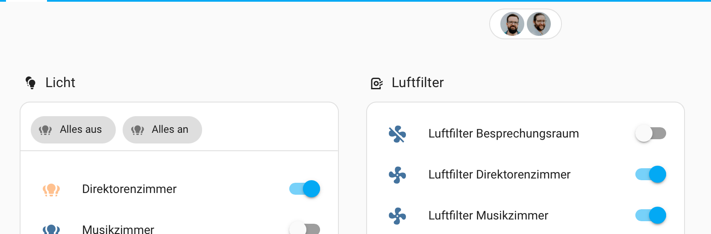

# Persons Badge

A custom badge for Home Assistant that displays profile pictures of persons who are currently at home.

## Features

- Shows profile pictures of persons who are currently at home
- Click on a person's picture to show more information
- Hover effect to enlarge the picture
- Automatically updates when person states change

## Installation

1. Install [HACS](https://hacs.xyz/)
2. Add this repository as a custom repository in HACS
3. Install the badge through HACS
4. Add the badge to your dashboard

## Usage

Add this to your dashboard configuration:

```yaml
badges:
  - type: "custom:persons-badge"
```

## Options

| Name | Type   | Required | Default | Description                    |
| ---- | ------ | -------- | ------- | ------------------------------ |
| type | string | yes      | -       | Must be `custom:persons-badge` |

## Screenshots



## Credits

Created by [Your Name]
